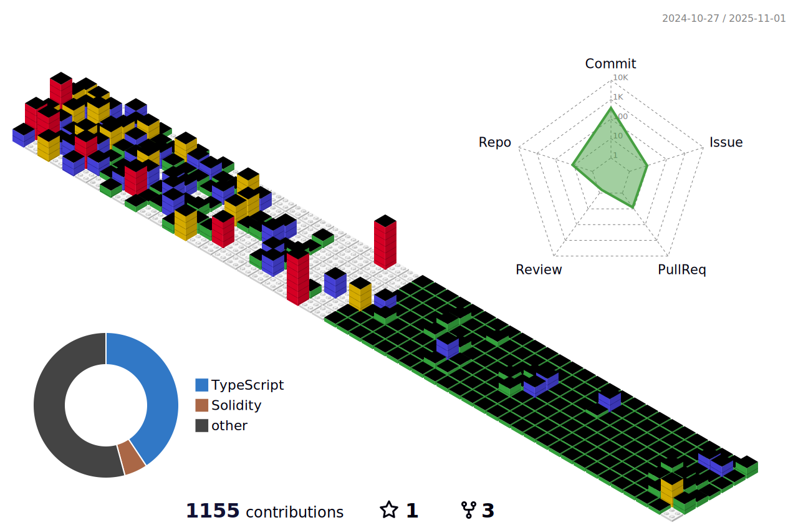

## Hello World 🐧

I build user-friendly products that make crypto more accessible.

- **Product-minded engineer** with experience in both frontend/backend development and product design
- **Hackathon enthusiast**, recognized for innovative solutions in Web3 and crypto domains

### 🧰 Tech Stacks

<table>
  <tr>
    <td><strong>Languages</strong></td>
    <td>    </td>
  </tr>
  <tr>
    <td><strong>Web</strong></td>
    <td>   </td>
  </tr>
  <tr>
    <td><strong>Infrastructure & Tools</strong></td>
    <td>    </td>
  </tr>
  <tr>
    <td><strong>Design</strong></td>
    <td></td>
  </tr>
  <tr>
    <td><strong>Interested & Studying</strong></td>
    <td>  </td>
  </tr>
</table>

### 💼 Work Experiences

- **Unveiled Inc.** – Software Engineer _(2024.7 – 2025.2)_ 
  Leading product design and full-stack development of user-focused Web3 applications.

- **Mesher Inc.** – Product Manager & Software Engineer _(2022.6 – 2023.8)_ 
  Planned and built Web3 onboarding tools and AI-integrated interfaces, while developing smart contracts for DeFi and gaming ecosystems.

### 🥇 Hackathons

- **ETHTaipei 2025 : [Vault Royale](https://github.com/pengtoshi/vault-royale-monorepo)**  
  Ultimate battleground for AI-powered yield vaults.

- **ETHBangkok 2024 : [Planty](https://github.com/pengtoshi/planty-frontend)** 🏆🏆🏆  
  Tokenized rare plant investment ecosystem that bridges the gap between skilled plant managers and investors.

- **ETHSeoul 2024 : [Split](https://github.com/pengtoshi/split-public-integrated)** 🏆🏆🏆  
  On-chain referral marketing platform with event-based reward distribution.

- **ETHSeoul 2023 : [WalletMetrics](https://github.com/pengtoshi/walletmetrics-server)** 🆠 
  Code-free product analytics dashboard builder for DApps.

- **BNB Chain Hackathon Korea : [Fantosi](https://github.com/Fantosi/Fantosi)** 
  Blockchain-based transparent fund management and governance platform for K-pop fan communities

- **Dreamplus Blockchain Hackathon 2022 : [VALIDATOR](https://github.com/pengtoshi/validator-backend)** 🆠 
  Web3 whoscall-like service to detect phishing and scam links in blockchain.

- **ETHSanFrancisco 2022 : [Swallow](https://github.com/mesher-labs/swallow-monorepo)** 🆠 
  Web3 shortcut tool for non-developers and casual users to access on-chain services easily.

### 🎓 Academy & Education

- **Korea University, Seoul** – Computer Science & Engineering
- **Blockchain Valley** – Co-founder of the korea university blockchain academy

### 📧 Contacts

 
 

